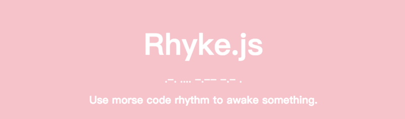
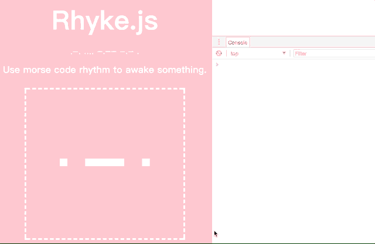

[中文文档](https://segmentfault.com/a/1190000012046401)

# RhykeJS

Use morse code rhythm to awake something.

# Why RhykeJS
When a front-end project on production, there are functions that still need to be invisible — unless certain conditions were reached. We can call these functions as “experiment function”. In many ways, people use a switch or some keyword to turn these functions on, and Rhyke use its own idea — using morse code gesture rhythm.



# How does it work?
Rhyke comes from “rhythm” and “awake”, which means “Awake something by rhythm”.

Inside RhykeJS, it listens mouse or touch events from the user defined area. By setting `dashTime`, it understands how long dose a click means “short signal” or “long signal”, and translates them into string `.` and `-` rhythm. Once the input rhythm matches the defined rhythm, something will be triggered.

https://codepen.io/jrainlau/pen/vWWypv

## Install
```
yarn add rhyke
```

## Usage
`RhykeJS` was built in `umd`, you can use it in different way:

- ES6 modules
```javascript
import Rhyke from 'rhyke'
```

- CommonJS
```javascript
const Rhyke = require('rhyke')
```

- Web broswer
```html
<script src="rhyke.js"></script>
<script>
    const Rhyke = window.Rhyke
</script>
```

The `Rhyke` instance is a constructor, you must use `new` operator to get initialization.

```javascript
const rhyke = new Rhyke({
    el: 'body',
    rhythm: '...---...',
    matching (rhyArr) {
      // get user input rhythm array
      // such as [".", ".", "-", "-", "-", "."]
    },
    matched () {
      // trigger when rhythm matched
    },
    unmatched () {
      // trigger when rhythm unmatched
    },
    onTimeout () {
      // trigger when timeout
    }
})
```

## Options
`Rhyke` accepts one object as its options:
```javascript
defaultOptions = {
    // morse code listening area
    el: 'body',
    // define your rhythm, use "." as dots and "-" as dashes
    rhythm: '...',
    // how long from "dot" to "dash"
    dashTime: 400,
    // timeout for resetting input
    timeout: 2000,
    // RhykeJS uses mouse event in default; once the page was in mobile mode,
    // you should set `tabEvent` to `true`, then RhykeJS would use touch event in replace.
    tabEvent: false,
    // get user input rhythm array
    matching: () => {},
    // trigger when rhythm matched
    matched: () => {},
    // trigger when rhythm unmatched
    unmatched: () => {},
    // trigger when timeout
    onTimeout: () => {}
}
```

## API
Once the `matched` or `unmatched` triggered, you may want to remove the event listener of the element you bind:
```javascript
matched () {
  // something was awoke
  rhyke.removeListener()
}
```

## License
MIT
